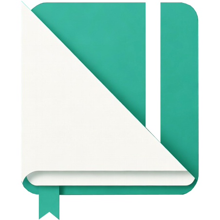

<p align="center">
  
</p>

<h1 align="center">Notiq</h1>

<p align="center">
  <strong>Offline-first note-taking PWA</strong> with real-time collaboration, encrypted vault, and invitation-based authentication.
</p>

<p align="center">
  
  
  
  
  
</p>

---

## Features

<table>
<tr>
<td width="50%">

**Rich Text Editor**
TipTap v2 with tables, code blocks, task lists, images, audio recording, live status bar, and list-to-Kanban/TaskList transform.

**Real-time Collaboration**
Yjs + Hocuspocus WebSocket server with persistent user colors and avatar presence indicators.

**Offline-first**
Dexie.js (IndexedDB) with background sync queue. Works without internet, syncs when reconnected.

**Encrypted Vault**
PBKDF2-derived AES-encrypted notes and credentials behind PIN protection.

</td>
<td width="50%">

**Kanban Boards**
Drag-and-drop boards with columns, cards, comments, assignees, due dates, priority levels, note linking with smart sharing, activity history, board chat, cover images, completion tracking, auto-archiving, task list linking, and real-time SSE updates.

**Task Lists**
Collaborative task/shopping lists with checkable items, priority levels, sharing with real-time notifications, and check ownership tracking.

**Sharing & Groups**
Note, notebook, task list, and kanban sharing with granular permissions. User groups with invitation management and member visibility.

**AI Chat & Import**
Per-note AI assistant (AWS Bedrock). Evernote (.enex) and OneNote (.mht, .html, .zip) import with attachment support.

</td>
</tr>
</table>

**Also:** Reminders, PWA with push notifications, multi-language (EN/IT), collapsible sidebar with icon rail, admin panel with audit logs.

---

## Tech Stack

| Layer | Technologies |
|:------|:------------|
| **Frontend** | React 19, Vite 7, TipTap v2, Zustand, TanStack Query v5, Dexie.js v4, TailwindCSS 3, i18next |
| **Backend** | Node.js 20+, Fastify 5, Prisma 7, PostgreSQL 15, Hocuspocus v3, Zod v4, Pino, Nodemailer, web-push |
| **Infra** | Docker Compose, IIS + ARR (production), PWA via vite-plugin-pwa |

---

## Architecture

```
Frontend (React SPA)
  ├── Dexie (IndexedDB)       ← offline storage
  ├── SyncService              ← background sync queue
  ├── TipTap Editor            ← rich text editing
  └── HocuspocusProvider       ← real-time collaboration (WebSocket)
       │
       ▼
Backend (Fastify)
  ├── Routes (Zod validation)
  ├── Services (business logic)
  ├── Prisma ORM ──────────── → PostgreSQL
  ├── Hocuspocus Server        → Yjs WebSocket
  └── Pino                     → structured logging
```

**Data flow:** User types → Dexie write (instant) → SyncQueue → REST API → Prisma

**Collab flow:** TipTap → Yjs → HocuspocusProvider → WebSocket → Hocuspocus Server → Prisma

---

## Quick Start

### Prerequisites

- Node.js 20+
- PostgreSQL 15+
- npm

### Setup

```bash
# Clone
git clone https://github.com/GitBakko/Notiq.git
cd Notiq

# Backend
cd backend
cp .env.example .env        # Configure DATABASE_URL, JWT_SECRET, FRONTEND_URL
npm install
npx prisma migrate deploy
npx prisma generate
npm run dev                  # Starts on :3001

# Frontend (new terminal)
cd frontend
npm install
npm run dev                  # Starts on :5173 (proxies API to :3001)
```

### Docker

```bash
docker compose up -d --build
```

### Environment Variables

<details>
<summary><strong>Backend</strong> (<code>backend/.env</code>)</summary>

| Variable | Description | Default |
|:---------|:-----------|:--------|
| `DATABASE_URL` | PostgreSQL connection string | Required |
| `JWT_SECRET` | Secret for JWT signing | Required |
| `FRONTEND_URL` | Frontend origin for CORS | `http://localhost:5173` |
| `LOG_LEVEL` | Pino log level | `info` |

</details>

<details>
<summary><strong>Frontend</strong> (<code>frontend/.env.production</code>)</summary>

| Variable | Description | Default |
|:---------|:-----------|:--------|
| `VITE_API_URL` | API base URL | `/api` |
| `VITE_WS_URL` | WebSocket URL | Required for prod |
| `VITE_VAPID_PUBLIC_KEY` | VAPID key for push notifications | Built-in fallback |

</details>

---

## Project Structure

```
Notiq/
  backend/
    src/
      routes/        # Fastify route plugins (Zod-validated)
      services/      # Business logic layer
      utils/         # Logger, text extraction
      plugins/       # Prisma client singleton
      scripts/       # CLI tools (admin, backup, migration)
    prisma/
      schema.prisma  # 30 models, 21 migrations
  frontend/
    src/
      components/    # Reusable UI (editor/, layout/, sharing/, ui/)
      features/      # Domain modules (auth, notes, vault, groups, tasks, kanban)
      store/         # Zustand stores (auth, vault, ui)
      lib/           # API client, Dexie DB, i18n
      locales/       # en.json, it.json
    e2e/             # Playwright E2E tests
  deploy/            # Deployment scripts (pre/post-install)
```

---

## Security

- JWT authentication with token expiration and version-based invalidation
- Zod input validation on all API routes
- CORS whitelist (configurable per environment)
- Per-route rate limiting on sensitive endpoints
- XSS sanitization on user-generated content
- IDOR protection on all resource endpoints
- Structured logging (no sensitive data in logs)
- Import file size limits and XXE protection

---

<p align="center">
  
</p>

<p align="center">
  <sub>Private project &mdash; built with precision.</sub>
</p>
